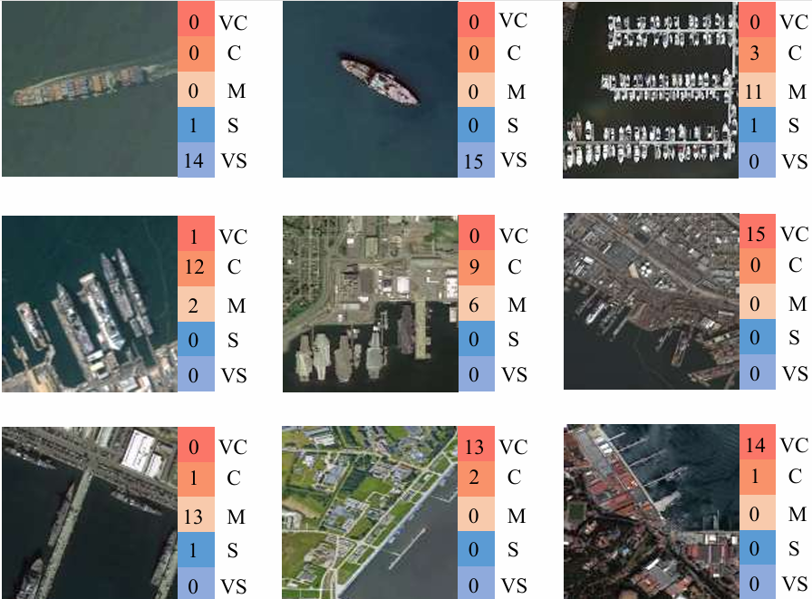
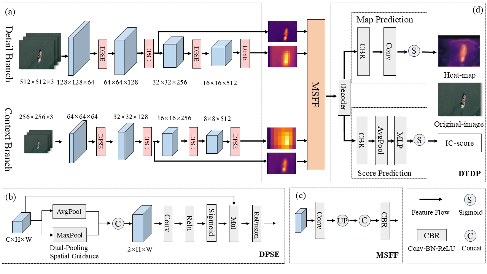

# *HRSSC-Bench: A Complexity Assessment Benchmark for Remote Sensing Object Detection*
The official code and dataset of our paper:

*HRSSC-Bench: A Complexity Assessment Benchmark for Remote Sensing Object Detection*

 

# Dataset Overview
We construct the High-Resolution Remote Sensing Ship Complexity Benchmark (HRSSC-Bench) specifically for image complexity assessment in remote sensing ship detection. Different from general image complexity datasets, HRSSC-Bench adopts a four-dimensional evaluation system including Edge Clarity (EC), Texture Similarity (TS), Target Density (TD) and Scale Variation (SV) that conform to the characteristics of remote sensing scenes. All samples are divided into five hierarchical complexity levels via manual annotation. The figure below displays typical samples with different complexity grades and corresponding four-dimensional metric distributions.

  

 

# BICNet Pipeline
To remedy the insufficient spatial feature interaction and poor remote sensing adaptability of baseline, we propose BICNet (Bidirectional Interactive Complexity Network). Built on the dual-branch ResNet18 backbone, BICNet preserves detail and global context extraction branches. Meanwhile, it integrates three effective enhancements: dual-path spatial enhancement, multi-scale feature fusion, and dual-task decoupling prediction. These designs fully exploit spatial and multi-scale remote sensing features, realize bidirectional branch interaction, and jointly optimize pixel-level complexity heatmap prediction and image-level complexity score regression.

  

  

#HRSSC-Bench dataset
For academic purposes, you can reproduce the IC9600 dataset following the official paper instructions or contact the authors to obtain the dataset.

 

# Citation
If you find our dataset and code helpful for your research, please cite our work. The full citation will be updated upon official publication.
